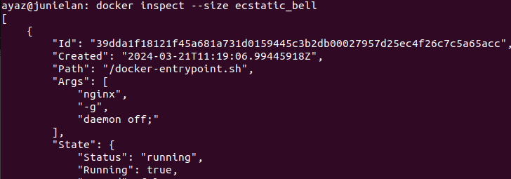
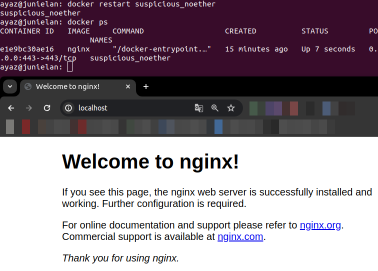
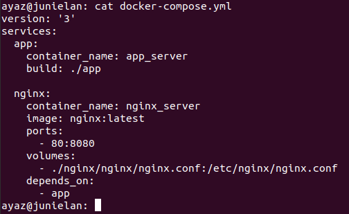

# Simple Docker

Введение в докер. Разработка простого докер-образа для собственного сервера.

## Contents

1. [Готовый докер](#part-1-готовый-докер) 
2. [Операции с контейнером](#part-2-операции-с-контейнером) 
3. [Мини веб-сервер](#part-3-мини-веб-сервер) 
4. [Свой докер](#part-4-свой-докер) 
5. [Dockle](#part-5-dockle) 
6. [Базовый Docker Compose](#part-6-базовый-docker-compose)

## Rules

В качестве результата работы по первым двум задачам должен быть предоставлен отчет.
В каждой части задания указано, что должно быть помещено в отчёт, после её выполнения.
Это могут быть ответы на вопросы, скриншоты и т.д.

В качестве результата работы по третьей задаче должны быть предоставлены исходные файлы для запуска веб-сервера.

В качестве результата работы по четвёртой и пятой задачам должны быть предоставлены докерфайлы.

В качестве результата работы по шестой задаче должен быть предоставлен файл *docker-compose.yml* и нужные для его запуска докерфайлы (если они не были предоставлены ранее).

- В репозиторий, в папку src, должен быть загружен отчёт с расширением .md;
- В отчёте должны быть выделены все части задания, как заголовки 2-го уровня;
- В рамках одной части задания всё, что помещается в отчёт, должно быть оформлено в виде списка;
- Каждый скриншот в отчёте должен быть кратко подписан (что показано на скриншоте);
- Все скриншоты обрезаны так, чтобы была видна только нужная часть экрана;
- На одном скриншоте допускается отображение сразу нескольких пунктов задания, но они все должны быть описаны в подписи к скриншоту;
- В репозиторий, в папку src/server, должны быть загружены исходные файлы для запуска веб-сервера из третьего задания;
- В репозиторий, в папку src, должны быть загружены итоговые докерфайлы для запуска образов из четвёртого и пятого заданий;
- В репозиторий, в папку src, должен быть загружен *docker-compose.yml* шестого задания;
- Необходимо быть готовым продемонстрировать решение вживую при необходимости.

## Part 1. Готовый докер

В качестве конечной цели своей небольшой практики ты сразу выбрал написание докер-образа для собственного веб-сервера, а потому в начале тебе нужно разобраться с уже готовым докер-образом для сервера.
Твой выбор пал на довольно простой **nginx**.

**== Задание ==**

* Возьми официальный докер-образ с **nginx** и выкачай его при помощи `docker pull`.

  - 

* Проверь наличие докер-образа через `docker images`.

  - 

* Запусти докер-образ через `docker run -d [image_id|repository]`.

  - 

* Проверь, что образ запустился через `docker ps`.

  - 

* Посмотри информацию о контейнере через `docker inspect [container_id|container_name]`.

  - 

* По выводу команды определи и помести в отчёт размер контейнера, список замапленных портов и ip контейнера.
  + размер контейнера: 
      - 
  + список замапленных портов: 
      - 
  + ip контейнера: 
      - 

* Останови докер образ через `docker stop [container_id|container_name]`.

  - 

* Проверь, что образ остановился через `docker ps`.

  - 

* Запусти докер с портами 80 и 443 в контейнере, замапленными на такие же порты на локальной машине, через команду *run*.

  - 

* Проверь, что в браузере по адресу *localhost:80* доступна стартовая страница **nginx**.

  - 

* Перезапусти докер контейнер через `docker restart [container_id|container_name]`.
* Проверь любым способом, что контейнер запустился.

  - 

## Part 2. Операции с контейнером

Докер-образ и контейнер готовы. Теперь можно покопаться в конфигурации **nginx** и отобразить статус страницы.

**== Задание ==**

* Прочитай конфигурационный файл *nginx.conf* внутри докер контейнера через команду *exec*.

  - 

* Создай на локальной машине файл *nginx.conf*.
* Настрой в нем по пути */status* отдачу страницы статуса сервера **nginx**.

  - 

* Скопируй созданный файл *nginx.conf* внутрь докер-образа через команду `docker cp`.

  - 

* Перезапусти **nginx** внутри докер-образа через команду *exec*.

  - 

* Проверь, что по адресу *localhost:80/status* отдается страничка со статусом сервера **nginx**.

  - 

* Экспортируй контейнер в файл *container.tar* через команду *export*.

  - 

* Останови контейнер.

  - 

* Удали образ через `docker rmi [image_id|repository]`, не удаляя перед этим контейнеры.

  - 

* Удали остановленный контейнер.

  - 

* Импортируй контейнер обратно через команду *import*.

  - ![docker import -c 'CMD ["nginx", "-g", "daemon off;"]' container.tar](./misc/part_2/docker_import_c_container_tar.png)

* Запусти импортированный контейнер.

  - 

* Проверь, что по адресу *localhost:80/status* отдается страничка со статусом сервера **nginx**.

  - 

## Part 3. Мини веб-сервер

Теперь стоит немного оторваться от докера, чтобы подготовиться к последнему этапу. Время написать свой сервер.

**== Задание ==**

##### Напиши мини-сервер на **C** и **FastCgi**, который будет возвращать простейшую страничку с надписью `Hello World!`.

* Подготовить контейнер для работы с Fastcgi
  apt-get update

  apt-get install -y gcc libfcgi-dev spawn-fcgi

  - 

* Запусти написанный мини-сервер через *spawn-fcgi* на порту 8080.

  gcc main.c -lfcgi -o mini_server

  spawn-fcgi -p8080 -n ./mini_server

  - 

* Напиши свой *nginx.conf*, который будет проксировать все запросы с 81 порта на *127.0.0.1:8080*.

  - 

* Проверь, что в браузере по *localhost:81* отдается написанная тобой страничка.

  - 

* Положи файл *nginx.conf* по пути *./nginx/nginx.conf* (это понадобится позже).

  - 

## Part 4. Свой докер

Теперь всё готово. Можно приступать к написанию докер-образа для созданного сервера.

**== Задание ==**

*При написании докер-образа избегай множественных вызовов команд RUN*

* Напиши свой докер-образ, который:
  1) собирает исходники мини сервера на FastCgi из [Части 3](#part-3-мини-веб-сервер);
  2) запускает его на 8080 порту;
  3) копирует внутрь образа написанный *./nginx/nginx.conf*;
  4) запускает **nginx**.
_**nginx** можно установить внутрь докера самостоятельно, а можно воспользоваться готовым образом с **nginx**'ом, как базовым._

  - 
  
* Собери написанный докер-образ через `docker build` при этом указав имя и тег.
docker build -t fcgi_container:first .

* Проверь через `docker images`, что все собралось корректно.
docker images

  - 

* Запусти собранный докер-образ с маппингом 81 порта на 80 на локальной машине и маппингом папки *./nginx* внутрь контейнера по адресу, где лежат конфигурационные файлы **nginx**'а (см. [Часть 2](#part-2-операции-с-контейнером)).

  - 

* Проверь, что по localhost:80 доступна страничка написанного мини сервера.

  - 

* Допиши в *./nginx/nginx.conf* проксирование странички */status*, по которой надо отдавать статус сервера **nginx**.
  
  - 

* Перезапусти докер-образ.
  
  - 

*Если всё сделано верно, то, после сохранения файла и перезапуска контейнера, конфигурационный файл внутри докер-образа должен обновиться самостоятельно без лишних действий*
* Проверь, что теперь по *localhost:80/status* отдается страничка со статусом **nginx**
  
  - 

## Part 5. **Dockle**

После написания образа никогда не будет лишним проверить его на безопасность.

**== Задание ==**

* Просканируй образ из предыдущего задания через `dockle [image_id|repository]`.

  - 

* Исправь образ так, чтобы при проверке через **dockle** не было ошибок и предупреждений.

  - 

## Part 6. Базовый **Docker Compose**

Вот ты и закончил свою разминку. А хотя погоди...
Почему бы не поэкспериментировать с развёртыванием проекта, состоящего сразу из нескольких докер-образов?

**== Задание ==**

* Напиши файл *docker-compose.yml*, с помощью которого:
* 1) Подними докер-контейнер из [Части 5](#part-5-инструмент-dockle) _(он должен работать в локальной сети, т.е. не нужно использовать инструкцию **EXPOSE** и мапить порты на локальную машину)_.
* 2) Подними докер-контейнер с **nginx**, который будет проксировать все запросы с 8080 порта на 81 порт первого контейнера.
* Замапь 8080 порт второго контейнера на 80 порт локальной машины.
  - 

* Останови все запущенные контейнеры.
* Собери и запусти проект с помощью команд `docker-compose build` и `docker-compose up`.
  - 
* Проверь, что в браузере по *localhost:80* отдается написанная тобой страничка, как и ранее.
  - 